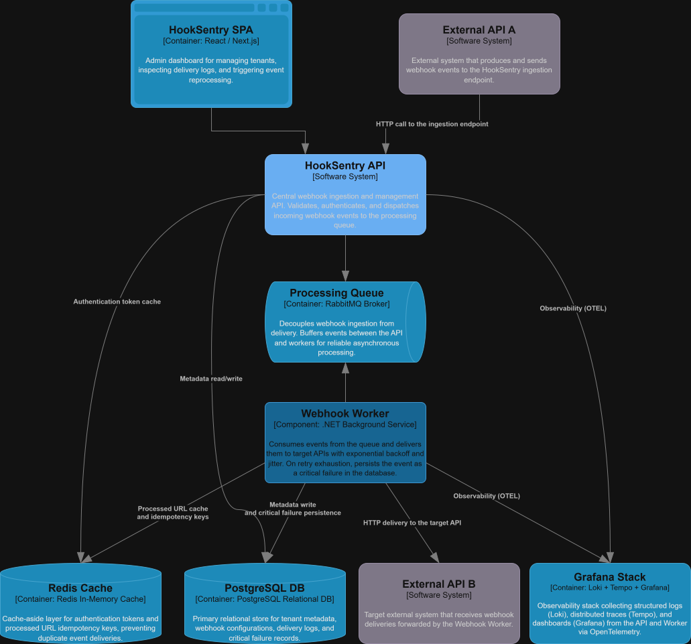

<div align="center">
  
  <h1>HookSentry</h1>
  <p><strong>Reliable webhook delivery platform built with .NET 10</strong></p>
  <p>
    Receives events via HTTP, queues through RabbitMQ, and delivers to configured destinations<br/>
    with exponential backoff, circuit breaking, HMAC signing, and full OpenTelemetry observability.
  </p>
</div>

---

## System Requirements

- [.NET 10 SDK](https://dotnet.microsoft.com/download/dotnet/10.0)
- Docker and Docker Compose

## Getting Started

Clone the repository and start the full stack:

```bash
cp .env.example .env          # fill in secrets
docker compose up -d
```

| Service | URL |
|---------|-----|
| API | http://localhost:8080 |
| Swagger UI | http://localhost:8080/swagger |
| Grafana | http://localhost:3001 |
| RabbitMQ | http://localhost:15672 |

### Running locally (development)

```bash
# Start infrastructure only
docker compose up postgres rabbitmq redis -d

# API (terminal 1)
dotnet run --project src/HookSentry.Api

# Worker (terminal 2)
dotnet run --project src/HookSentry.Worker
```

## Building

```bash
dotnet build HookSentry.slnx
```

Docker multi-stage build targeting `api` and `worker` from the same context:

```bash
docker build --target api    -t hooksentry-api    .
docker build --target worker -t hooksentry-worker .
```

## Testing

```bash
dotnet test src/HookSentry.Tests
```

## Architecture

<div align="center" style="margin-bottom:50px">
  <br/>
  
  <br/>
</div>

**Assemblies:**

| Project | Type | Responsibility |
|---------|------|----------------|
| `HookSentry.Domain` | Class Library | Entities, business rules, repository interfaces |
| `HookSentry.Infrastructure` | Class Library | NHibernate, Redis, RabbitMQ, OpenTelemetry, security |
| `HookSentry.Api` | ASP.NET Core Web API | REST endpoints, JWT + API Key auth |
| `HookSentry.Worker` | .NET Background Service | RabbitMQ consumer, HTTP delivery, retry, circuit breaker |
| `HookSentry.Tests` | xUnit | Unit and integration tests |

## Delivery

The Worker processes messages from `webhooks.delivery`. On HTTP failure it republishes into native RabbitMQ delay queues — no plugins required:

| Queue | Delay | Retry |
|-------|-------|-------|
| `hooksentry.delay.2m` | 2 min | 1st |
| `hooksentry.delay.5m` | 5 min | 2nd |
| `hooksentry.delay.15m` | 15 min | 3rd |
| `hooksentry.delay.1h` | 1 hour | 4th |
| `hooksentry.delay.6h` | 6 hours | 5th+ |

After `MaxTrys` (configurable per tenant) the event is marked `CriticalFailure` and available for manual replay via `POST /api/v1/events/{id}/replay`.

Circuit breaker trips after 5 consecutive HTTP failures and pauses delivery until the configured timer expires. Any `2xx` resets it.

## API

### Auth

| Method | Route | Auth | Description |
|--------|-------|------|-------------|
| `POST` | `/api/v1/auth/login` | — | Email + password → access token + refresh token |
| `POST` | `/api/v1/auth/refresh` | — | Renew access token |
| `POST` | `/api/v1/auth/logout` | JWT | Invalidate session |

### Tenants

| Method | Route | Auth | Description |
|--------|-------|------|-------------|
| `POST` | `/api/v1/tenants` | — | Create tenant + initial admin user |
| `GET` | `/api/v1/tenants/{id}` | JWT | Get tenant details |
| `PATCH` | `/api/v1/tenants/{id}` | JWT Admin | Update name and delivery settings |
| `GET` | `/api/v1/tenants/{id}/webhook-secret` | JWT | Retrieve HMAC-SHA256 signing secret |
| `POST` | `/api/v1/tenants/{id}/webhook-secret` | JWT | Rotate webhook secret |
| `POST` | `/api/v1/tenants/{id}/webhook-secret/verify` | JWT | Verify a `X-HookSentry-Signature` value |

### Users

| Method | Route | Auth | Description |
|--------|-------|------|-------------|
| `GET` | `/api/v1/users` | JWT | List users in tenant |
| `GET` | `/api/v1/users/{id}` | JWT | Get user details |
| `POST` | `/api/v1/users` | JWT | Create user |
| `PATCH` | `/api/v1/users/{id}` | JWT | Update user |
| `DELETE` | `/api/v1/users/{id}` | JWT | Remove user |

### Invites

| Method | Route | Auth | Description |
|--------|-------|------|-------------|
| `GET` | `/api/v1/invites` | JWT Admin | List invites in tenant |
| `POST` | `/api/v1/invites` | JWT Admin | Create pre-signed invite link |
| `POST` | `/api/v1/invites/{token}/register` | — | Register a Developer user via invite link |

### API Keys

| Method | Route | Auth | Description |
|--------|-------|------|-------------|
| `GET` | `/api/v1/apikeys` | JWT | List API keys |
| `POST` | `/api/v1/apikeys` | JWT | Create API key |
| `DELETE` | `/api/v1/apikeys/{id}` | JWT | Revoke API key |

### Destinations

| Method | Route | Auth | Description |
|--------|-------|------|-------------|
| `GET` | `/api/v1/destinations` | JWT | List destinations |
| `POST` | `/api/v1/destinations` | JWT | Create destination |
| `PATCH` | `/api/v1/destinations/{id}` | JWT | Update destination |
| `POST` | `/api/v1/destinations/{id}/ingest-token` | JWT | Rotate ingest token |
| `GET` | `/api/v1/destinations/{id}/senders` | JWT | List senders for a destination |
| `POST` | `/api/v1/destinations/{id}/senders` | JWT | Create sender for a destination |

### Senders

A **WebhookSender** adapts an external service's outbound webhook format to HookSentry's ingest format via a JSON payload mapping DSL. Each sender gets its own `sndr_` ingest token and an optional transformation map.

| Method | Route | Auth | Description |
|--------|-------|------|-------------|
| `GET` | `/api/v1/senders/{id}` | JWT | Get sender details |
| `DELETE` | `/api/v1/senders/{id}` | JWT | Remove sender |
| `POST` | `/api/v1/senders/{id}/ingest-token` | JWT | Rotate sender ingest token |
| `GET` | `/api/v1/senders/{id}/mapping` | JWT | Get payload mapping |
| `POST` | `/api/v1/senders/{id}/mapping` | JWT | Set payload mapping |
| `DELETE` | `/api/v1/senders/{id}/mapping` | JWT | Remove payload mapping |

### Events

| Method | Route | Auth | Description |
|--------|-------|------|-------------|
| `GET` | `/api/v1/events` | JWT | List events with pagination and filters |
| `GET` | `/api/v1/events/{id}` | JWT | Get event details |
| `POST` | `/api/v1/events/{id}/replay` | JWT | Replay a `CriticalFailure` event |

### Ingest

| Method | Route | Auth | Description |
|--------|-------|------|-------------|
| `POST` | `/api/v1/ingest/{tenantId}/{token}` | Token | Receive event and publish to queue |

Token prefix `dst_` routes directly to a destination; `sndr_` routes through a WebhookSender's mapping. Supports `X-Idempotency-Key` for 24h deduplication via Redis.

### Health

| Method | Route | Auth | Description |
|--------|-------|------|-------------|
| `GET` | `/health` | — | Health check |

## Configuration

Minimum required `.env`:

```env
ConnectionStrings__HookSentry=Host=postgres;Port=5432;Database=hooksentry;Username=hooksentry;Password=hooksentry
RabbitMq__Host=rabbitmq
RabbitMq__Username=hooksentry
RabbitMq__Password=hooksentry
Redis__ConnectionString=redis:6379
Jwt__Secret=CHANGE_ME_MIN_32_CHARACTERS_LONG_SECRET
CredentialEncryption__Key=CHANGE_ME_32_BYTES_BASE64_ENCODED=
ASPNETCORE_HTTP_PORTS=8080
Otel__Endpoint=http://tempo:4317
```

## Tech Stack

| Layer | Technology |
|-------|------------|
| Runtime | .NET 10 |
| ORM | FluentNHibernate 3.4 + Npgsql 8 |
| Database | PostgreSQL 17 |
| Message queue | RabbitMQ 4 (AMQP, no external plugins) |
| Cache | Redis 7 (StackExchange.Redis) |
| Auth | JWT Bearer + API Key |
| Password hashing | Argon2id |
| Credential encryption | AES-256-GCM |
| Observability | OpenTelemetry → Loki + Tempo + Grafana |
| API docs | Swagger / OpenAPI |

## License

Licensed under the [Apache License 2.0](LICENSE).
