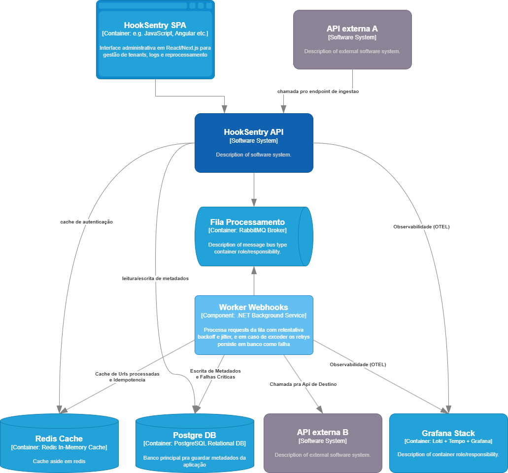

# HookSentry API

A reliable webhook delivery platform built with .NET 10. Receives events via an HTTP ingestion endpoint, queues them through RabbitMQ, and delivers them to configured destination URLs with exponential backoff, circuit breaking, HMAC signing, and full OpenTelemetry observability.

## Architecture



**Assemblies:**

| Projeto | Tipo | Responsabilidade |
|---------|------|-----------------|
| `HookSentry.Domain` | Class Library | Entidades, regras de negócio, interfaces de repositório |
| `HookSentry.Infrastructure` | Class Library | NHibernate, Redis, RabbitMQ, OpenTelemetry, segurança |
| `HookSentry.Api` | ASP.NET Core Web API | Endpoints REST, autenticação JWT + API Key |
| `HookSentry.Worker` | .NET Background Service | Consumer RabbitMQ, entrega HTTP, retry, circuit breaker |
| `HookSentry.Tests` | xUnit | Testes unitários e de integração |

## Quick Start

### Pré-requisitos

- [.NET 10 SDK](https://dotnet.microsoft.com/download/dotnet/10.0)
- Docker e Docker Compose

### Com Docker Compose

```bash
# 1. Copiar e preencher as variáveis de ambiente
cp .env.example .env

# 2. Subir toda a stack (Postgres, RabbitMQ, Redis, Loki, Tempo, Grafana, API, Worker)
docker compose up -d

# API disponível em:  http://localhost:8080
# Swagger UI em:      http://localhost:8080/swagger
# Grafana em:         http://localhost:3001
# RabbitMQ UI em:     http://localhost:15672
```

### Rodando localmente (desenvolvimento)

```bash
cd hooksentry-api

# Subir apenas a infraestrutura
docker compose up postgres rabbitmq redis -d

# Rodar a API
dotnet run --project src/HookSentry.Api

# Rodar o Worker (outro terminal)
dotnet run --project src/HookSentry.Worker
```

## Configuração

### Arquivo `.env` (template)

```env
# Banco
ConnectionStrings__HookSentry=Host=postgres;Port=5432;Database=hooksentry;Username=hooksentry;Password=hooksentry

# RabbitMQ
RabbitMq__Host=rabbitmq
RabbitMq__Username=hooksentry
RabbitMq__Password=hooksentry
RabbitMq__EventsExchange=hooksentry.events
RabbitMq__PrefetchCount=100

# Redis
Redis__ConnectionString=redis:6379

# JWT
Jwt__Secret=CHANGE_ME_MIN_32_CHARACTERS_LONG_SECRET
Jwt__Issuer=hooksentry
Jwt__Audience=hooksentry
Jwt__AccessTokenExpirationMinutes=60
Jwt__RefreshTokenExpirationDays=7

# Criptografia de credenciais de destino (AES-256-GCM)
CredentialEncryption__Key=CHANGE_ME_32_BYTES_BASE64_ENCODED=

# ASP.NET
ASPNETCORE_ENVIRONMENT=Production
ASPNETCORE_HTTP_PORTS=8080

# OpenTelemetry
Otel__Endpoint=http://tempo:4317
Otel__ServiceName=hooksentry-api
```

### `appsettings.json` (desenvolvimento local)

```json
{
  "ConnectionStrings": {
    "DefaultConnection": "Host=localhost;Port=5432;Database=hooksentry;Username=hooksentry;Password=hooksentry",
    "Redis": "localhost:6379"
  },
  "Jwt": {
    "Key": "dev-secret-key-min-32-chars-long!!",
    "Issuer": "hooksentry-api",
    "Audience": "hooksentry-client"
  },
  "RabbitMq": {
    "Host": "localhost",
    "Port": 5672,
    "Username": "hooksentry",
    "Password": "hooksentry",
    "VirtualHost": "/",
    "EventsExchange": "hooksentry.events"
  },
  "Otel": {
    "Endpoint": "http://localhost:4317",
    "ServiceName": "hooksentry-api"
  }
}
```

## API Endpoints

### Autenticação

| Método | Rota | Descrição |
|--------|------|-----------|
| `POST` | `/api/v1/auth/login` | Login com e-mail e senha; retorna access token + refresh token |
| `POST` | `/api/v1/auth/refresh` | Renova access token via refresh token |
| `POST` | `/api/v1/auth/logout` | Invalida a sessão (remove do cache Redis) |

### Tenants / Usuários

| Método | Rota | Descrição |
|--------|------|-----------|
| `GET` | `/api/v1/users` | Lista usuários do tenant |
| `GET` | `/api/v1/users/{id}` | Detalha um usuário |
| `POST` | `/api/v1/users` | Cria usuário |
| `PATCH` | `/api/v1/users/{id}` | Atualiza usuário |
| `DELETE` | `/api/v1/users/{id}` | Remove usuário |

### Convites

| Método | Rota | Descrição |
|--------|------|-----------|
| `POST` | `/api/v1/invites` | Cria link de convite pré-assinado para novo usuário |

### API Keys

| Método | Rota | Descrição |
|--------|------|-----------|
| `GET` | `/api/v1/api-keys` | Lista API keys do tenant |
| `POST` | `/api/v1/api-keys` | Cria nova API key |
| `DELETE` | `/api/v1/api-keys/{id}` | Revoga uma API key |

### Destinos (Webhook Destinations)

| Método | Rota | Descrição |
|--------|------|-----------|
| `GET` | `/api/v1/destinations` | Lista destinos do tenant |
| `POST` | `/api/v1/destinations` | Cria destino (URL + autenticação opcional) |
| `PATCH` | `/api/v1/destinations/{id}` | Atualiza destino |
| `POST` | `/api/v1/destinations/{id}/ingest-token` | Rotaciona o token de ingestão |

### Ingestão de Eventos

| Método | Rota | Descrição |
|--------|------|-----------|
| `POST` | `/api/v1/ingest/{tenantId}/{token}` | Recebe evento e publica na fila |

O token pode ser do tipo `dst_` (ingestão direta por destino) ou `sndr_` (via WebhookSender). Suporta o header `X-Idempotency-Key` para deduplicação em 24h via Redis.

### Eventos

| Método | Rota | Descrição |
|--------|------|-----------|
| `GET` | `/api/v1/events` | Lista eventos com paginação e filtros |
| `GET` | `/api/v1/events/{id}` | Detalha um evento |
| `POST` | `/api/v1/events/{id}/replay` | Reprocessa manualmente um evento em `CriticalFailure` |

## Funcionalidades

### Entrega com Retry e Backoff

O Worker processa mensagens da fila `webhooks.delivery`. Em caso de falha HTTP, republica em filas de delay nativas do RabbitMQ (sem plugins):

| Fila | Delay | Retry |
|------|-------|-------|
| `hooksentry.delay.2m` | 2 min | 1ª tentativa |
| `hooksentry.delay.5m` | 5 min | 2ª tentativa |
| `hooksentry.delay.15m` | 15 min | 3ª tentativa |
| `hooksentry.delay.1h` | 1 hora | 4ª tentativa |
| `hooksentry.delay.6h` | 6 horas | 5ª+ tentativa |

Ao esgotar `MaxTrys` (configurável por tenant), o evento é marcado como `CriticalFailure` e fica disponível para replay manual. O slot de prefetch é liberado imediatamente após o nack — sem `Task.Delay` bloqueando workers.

### Circuit Breaker

Detecta destinos com falhas consecutivas e pausa as entregas automaticamente:

```
CLOSED ──(5 falhas consecutivas)──► OPEN
  ▲                                    │
  │ sucesso                            │ timer expirado
  └──────── HALF_OPEN ◄────────────────┘
                 │ falha
                 └──► OPEN (novo timer)
```

- **Threshold:** 5 falhas HTTP consecutivas (inclusive `401`, `403`, `404`)
- **Reset:** qualquer resposta `2xx`
- **Timer:** configurável por tenant via `circuit_breaker_timer` (segundos)
- Mensagens com CB OPEN são adiadas sem incrementar `RetryCount`

### Assinatura HMAC-SHA256

Toda entrega inclui o header `X-HookSentry-Signature: sha256=<hex>` calculado sobre o payload bruto com o `WebhookSecret` do tenant — mesmo padrão de GitHub, Stripe e Shopify.

### Idempotência

O header `X-Idempotency-Key` garante deduplicação em 24h:
1. GET no Redis (`idempotency:{key}`) — cache O(1)
2. Em caso de miss: processamento normal e SET no Redis após commit
3. Fallback silencioso ao banco caso Redis esteja indisponível

### Cache de Destinos

`DestinationUrl` é cacheado no Redis (`destination:{id}`, TTL 10 min) para eliminar round-trips no path crítico de ingestão. Invalidado automaticamente em `PATCH /destinations/{id}` e na rotação de token.

### Rate Limit por Destino

O campo `server_rate_limit` de cada destino limita requisições simultâneas via `SemaphoreSlim` no Worker. Evita sobrecarga de destinos com baixa capacidade de concorrência.

## Observabilidade

Stack OpenTelemetry com exportação OTLP para **Tempo** (traces) e **Loki** (logs):

```
HookSentry API  ──┐
                  ├──► OTLP (gRPC :4317) ──► Tempo (traces) ──┐
HookSentry Worker─┘                      └──► Loki  (logs)  ──┤──► Grafana :3001
```

| Componente | Retenção | Porta |
|------------|----------|-------|
| Loki | 15 dias | 3100 |
| Tempo | 7 dias | 4317 (OTLP), 3200 (HTTP) |
| Grafana | — | 3001 |

Cada tentativa de entrega gera um span filho com `event.id`, `tenant.id`, `destination.id`, `http.attempt_number` e `http.response.status_code`. O `trace_id` é automaticamente injetado nos logs, permitindo correlação log ↔ trace no Grafana com um clique.

## Build com Docker

O `Dockerfile` usa multi-stage build com targets nomeados para gerar imagens separadas da API e do Worker a partir do mesmo repositório:

```dockerfile
# Stage 1 — build compartilhado
FROM mcr.microsoft.com/dotnet/sdk:9.0-alpine AS build
WORKDIR /src
COPY . .
RUN dotnet restore HookSentry.slnx
RUN dotnet publish src/HookSentry.Api/HookSentry.Api.csproj     -c Release -o /app/api    --no-restore
RUN dotnet publish src/HookSentry.Worker/HookSentry.Worker.csproj -c Release -o /app/worker --no-restore

# Stage 2 — imagem da API
FROM mcr.microsoft.com/dotnet/aspnet:9.0-alpine AS api
WORKDIR /app
COPY --from=build /app/api .
ENTRYPOINT ["dotnet", "HookSentry.Api.dll"]

# Stage 3 — imagem do Worker
FROM mcr.microsoft.com/dotnet/aspnet:9.0-alpine AS worker
WORKDIR /app
COPY --from=build /app/worker .
ENTRYPOINT ["dotnet", "HookSentry.Worker.dll"]
```

No `docker-compose.yml`, o mesmo contexto é buildado com `target: api` e `target: worker`.

## Testes

```bash
dotnet test src/HookSentry.Tests
```

## Stack Tecnológica

| Camada | Tecnologia |
|--------|------------|
| Runtime | .NET 10 |
| ORM | FluentNHibernate 3.4 + Npgsql 8 |
| Banco de dados | PostgreSQL 17 |
| Fila de mensagens | RabbitMQ 4 (AMQP, sem plugins externos) |
| Cache | Redis 7 (StackExchange.Redis) |
| Autenticação | JWT Bearer + API Key |
| Hash de senhas | Argon2id (Konscious.Security.Cryptography) |
| Criptografia de credenciais | AES-256-GCM |
| Observabilidade | OpenTelemetry → Loki + Tempo + Grafana |
| Documentação | Swagger / OpenAPI (Swashbuckle) |

## Estrutura de Diretórios

```
hooksentry-api/
├── src/
│   ├── HookSentry.Api/
│   │   ├── Features/
│   │   │   ├── ApiKeys/        # CRUD de API keys
│   │   │   ├── Auth/           # Login / Refresh / Logout
│   │   │   ├── Destinations/   # CRUD de destinos + rotação de token
│   │   │   ├── Events/         # Listagem, detalhe e replay
│   │   │   ├── Health/         # Health check
│   │   │   ├── Ingest/         # Endpoint de ingestão de eventos
│   │   │   ├── Invites/        # Convites de usuário
│   │   │   ├── Senders/        # WebhookSenders
│   │   │   ├── Tenants/        # Gestão de tenant
│   │   │   └── Users/          # CRUD de usuários
│   │   └── Program.cs
│   ├── HookSentry.Domain/
│   │   ├── ApiKeys/
│   │   ├── Destinations/       # DestinationUrl, CircuitBreakerState, WebhookDestinationState
│   │   ├── Events/
│   │   ├── Invites/
│   │   ├── Security/
│   │   ├── Senders/
│   │   ├── Tenants/
│   │   └── Users/
│   ├── HookSentry.Infrastructure/
│   │   ├── Destinations/       # DestinationCacheService
│   │   ├── Observability/      # AddObservability (OTel)
│   │   ├── Persistence/        # NHibernate mappings + repositórios
│   │   ├── RabbitMq/           # EventPublisher, EventMessage
│   │   └── Security/           # JWT, ApiKey, Argon2, AES
│   └── HookSentry.Worker/
│       └── Consumers/          # WebhookDeliveryConsumer (retry, CB, HMAC)
└── HookSentry.slnx
```

## Licença

Propriedade privada — todos os direitos reservados.
